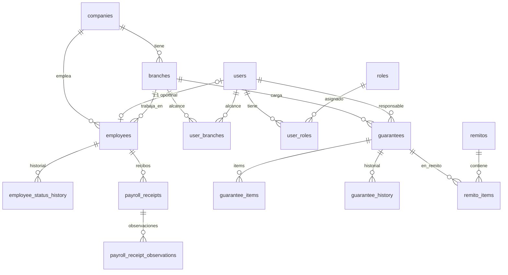

# Modelo de datos — ElectroGV (PostgreSQL)

Fuente de verdad del esquema relacional para la migración a PostgreSQL
(Fase 2: SQLAlchemy + Alembic). Se construye **desde cero** (sin migrar datos).

> Objetivo: relacional, escalable y entendible. FKs reales, PKs claras,
> tipos nativos de Postgres.

---

## 1. Convenciones generales

| Tema | Convención |
|---|---|
| **PK transaccional** | `id BIGINT GENERATED ALWAYS AS IDENTITY` |
| **PK de referencia** | `companies` y `branches` usan **slug TEXT** (`electro_gv`, `caseros`) — estables y legibles |
| **Claves naturales** | `UNIQUE` (ej. `users.username`, `employees.dni`, `guarantees.warranty_code`, `branches.code`) |
| **FKs** | siempre con índice; `ON DELETE CASCADE` en hijos, `RESTRICT`/`SET NULL` en referencias |
| **Timestamps** | `created_at`, `updated_at` → `timestamptz` (default `now()`) |
| **Booleanos** | `boolean` (no 0/1) |
| **JSON** | `jsonb` (no TEXT) |
| **Dinero** | `numeric(14,2)` |
| **Estados** | `varchar` + `CHECK` / validación en app (no ENUM de Postgres, para que evolucionen sin migración rígida) |
| **Naming** | `snake_case`; FK = `<entidad>_id` |

**Convención de borrado (ON DELETE):**
- **CASCADE** (hijos que no existen sin el padre): `*_items`, `*_history`, `*_observations`, `remito_items`.
- **RESTRICT** (no permitir borrar si hay dependencias): `companies`, `branches`, `users`, `roles`.
- **SET NULL** (vínculo opcional): `employees.user_id`, `guarantees.responsible_user_id`, `employees.manager_id`.

---

## 2. Dominio: Organización & Acceso

```
companies ──< branches ──< (referenciadas por casi todo)
users ──< user_roles >── roles
users ──< user_branches >── branches
```

### companies  *(PK slug)*
`id TEXT PK` · `name` · `legal_name` · `cuit` · `is_active bool` · timestamps.

### branches  *(PK slug)*
`id TEXT PK` · `company_id → companies (RESTRICT)` · `parent_branch_id → branches (auto-ref, SET NULL)` · `name` · `code UNIQUE` · `type` (`physical|web|deposit|admin`) · `is_active bool` · timestamps.

### users  **[nuevo en DB; hoy en users.json]**
`id BIGINT PK` · `username UNIQUE` · `display_name` · `password_hash` · `is_active bool` · `must_change_password bool` · timestamps.

### roles  **[nuevo en DB; hoy en roles.json]**
`id BIGINT PK` · `name UNIQUE` · `label` · `level int` · `permissions jsonb` (lista de claves; el catálogo vive en `permissions.py`) · timestamps.

### user_roles  *(N—N usuarios↔roles)*
`id BIGINT PK` · `user_id → users (CASCADE)` · `role_id → roles (RESTRICT)` · `is_primary bool` · `UNIQUE(user_id, role_id)`.

### user_branches  *(N—N = alcance operativo)*
`id BIGINT PK` · `user_id → users (CASCADE)` · `branch_id → branches (CASCADE)` · `is_primary bool` · `UNIQUE(user_id, branch_id)`.

---

## 3. Dominio: RRHH (Empleados)

```
employees ──1:1 opcional── users
employees ──< employee_status_history
employees ──< payroll_receipts ──< payroll_receipt_observations
employees ──< manager_id (auto-ref)
```

### employees
`id BIGINT PK` · `dni UNIQUE` · **`user_id → users (SET NULL, nullable)` — vínculo 1:1 opcional** · `company_id → companies` · `work_branch_id → branches` · `manager_id → employees (auto-ref, SET NULL)` · `first_name` · `last_name` · `display_name` · `position` · `department` · `address` · `birthdate date` · `gender` · `civil_status` · `contract_type` · `hire_date date` · `phone` · `personal_email` · `photo_url` · `photo_status` (`sin_foto|pendiente_aprobacion|solicitada_nuevamente|aprobada|rechazada`) · `photo_uploaded_at` · `status` (`alta|licencia|baja`) · timestamps.

> Cambio clave: el vínculo con el usuario pasa de `username` (string) a **`user_id` (FK real)**. La foto/recibos dejan de depender del username.

### employee_status_history
`id BIGINT PK` · `employee_id → employees (CASCADE)` · `status` · `previous_status` · `motivo` · `categoria` · `fecha_desde date` · `fecha_hasta date` · `observaciones` · `actor_user_id → users (SET NULL)` · `created_at`.

### payroll_receipts
`id BIGINT PK` · `employee_id → employees (RESTRICT)` · `period_year int` · `period_month int` · `receipt_type` · `file_path` · `file_name` · `file_content_type` · `file_size int` · `file_hash` · `status` (`pendiente|firmado|observado|anulado`) · `uploaded_by_user_id → users` · `signed_at` · `cancelled_*` · `replaced_by_receipt_id → payroll_receipts (SET NULL)` · timestamps. `INDEX(period_year, period_month)`.

### payroll_receipt_observations
`id BIGINT PK` · `receipt_id → payroll_receipts (CASCADE)` · `employee_id → employees` · `message` · `status` (`abierta|respondida`) · `answer_message` · `answered_by_user_id → users` · timestamps.

---

## 4. Dominio: Garantías

```
guarantees ──< guarantee_items
guarantees ──< guarantee_history
guarantees ──< remito_items >── remitos
guarantees ── parent_id (auto-ref, agrupadas)
guarantees ── branch_id / sucursal_responsable_id → branches
```

### guarantees
`id BIGINT PK` · `warranty_code UNIQUE` · `parent_id → guarantees (auto-ref, SET NULL)` · `company_id → companies` · `branch_id → branches` (sucursal de carga) · `sucursal_responsable_id → branches (nullable)` · `responsible_user_id → users (SET NULL)`
**Estado / flujo:** `status` · `review_status` (`pendiente_revision|en_revision|requiere_correccion|revisada`) · `ubicacion_actual` · `tipo_ingreso` · `origen_ingreso` · `transit_status`
**Proveedor:** `provider_name` · `provider_case_id` · `provider_response_type` (`retiro|revision|correccion|''`) · `provider_correction_note` · `estado_retiro_proveedor` · fechas (`sent_to_provider_at`, `last_provider_response_at`, etc. → `timestamptz`)
**Resolución:** `resultado_resolucion` · `numero_nota_credito` · `importe_nota_credito numeric(14,2)` · `detalle_reparacion` · `producto_reemplazo` · etc.
**Cliente:** `cliente_nombre` · `cliente_telefono` · `cliente_email` · `numero_factura` · `fecha_compra`
**Cierre:** `cancelled bool` · `fecha_finalizacion` · timestamps.

### guarantee_items
`id BIGINT PK` · `guarantee_id → guarantees (CASCADE)` · `item_index int` · `producto` · `sku` · `marca` · `tipo` · `serie` · `falla` · `observaciones` · `correction_note` · timestamps.

### guarantee_history
`id BIGINT PK` · `guarantee_id → guarantees (CASCADE)` · `actor_user_id → users (SET NULL)` · `action` · `old_status` · `new_status` · `note` · `details jsonb` · `created_at`.

### guarantee_counters  *(numeración por año/sucursal)*
`year int` + `branch_code text` → **PK compuesta** · `last_number int` · `updated_at`.
> En Postgres la asignación de número usa `SELECT … FOR UPDATE` (en vez del RLock actual).

### guarantee_exports / guarantee_sync_logs
Metadatos de exportaciones y sync. `id BIGINT PK` · `created_by_user_id → users` · campos de detalle (se portan 1:1 con upgrade de tipos). *(Los ítems del export quedan como `jsonb` por ahora; normalización opcional a futuro.)*

---

## 5. Dominio: Remitos

```
remitos ──< remito_items >── guarantees
```

### remitos  *(renombrado de `warranty_remitos`)*
`id BIGINT PK` · `remito_code UNIQUE` · `tipo_remito` (`sucursal_a_deposito|deposito_a_deposito|deposito_a_proveedor`) · `company_brand` · `origen_branch_id → branches` · `destino_branch_id → branches (nullable)` · `proveedor` · `status` (`pendiente|en_transito|recibido|anulado`) · `created_by_user_id → users` · fechas · `nota` · `pdf_path`.

### remito_items  **[nuevo — normaliza `warranty_ids_json`]**
`id BIGINT PK` · `remito_id → remitos (CASCADE)` · `guarantee_id → guarantees (RESTRICT)` · `UNIQUE(remito_id, guarantee_id)`.

---

## 6. Dominio: Ventas Web

### sales_web_requests
`id BIGINT PK` · `numero_solicitud UNIQUE` · `vendedor_user_id → users` · `branch_id → branches (nullable)` · `estado` · datos del cliente · `pago_tipo`/`entrega_tipo` · `costo_envio numeric(14,2)` · fechas de workflow (`taken_at`, `completed_at`, `cancelled_at` → `timestamptz`).

### sales_web_items
`id BIGINT PK` · `request_id → sales_web_requests (CASCADE)` · `sku` · `producto` · `cantidad int` · `precio_unitario numeric(14,2)` · `total_linea numeric(14,2)`.

---

## 7. Dominio: Sales BI  *(analítico)*
`sales_imports (id)` ──< `sales_records (id, import_id → CASCADE)` ; `sales_balances (id)`.
Importes → `numeric(14,2)`. Estructura analítica; se porta 1:1 con upgrade de tipos.

## 8. Dominio: Productos
`products (id)` · `product_brands (id)` · `providers (id)` · `brand_providers (id, brand_id→, provider_id→)` *(N—N marca↔proveedor)* · `product_sync_logs (id)`.
Precios/costos → `numeric(14,2)`.

## 9. Dominio: Sistema & Notificaciones
- `notifications (id)` · `user_id → users (CASCADE)` · `type`/`module`/`priority` · `entity_type`/`entity_id` · `read bool`.
- `push_subscriptions (id)` · `user_id → users (CASCADE)` · `endpoint` · `UNIQUE(user_id, endpoint)`.
- `fcm_tokens (id)` · `user_id → users (CASCADE)` · `token`.
- `jobs (id TEXT PK)` · ejecuciones de herramientas · `payload jsonb`.
- `app_events (id)` · auditoría · `actor_user_id → users (SET NULL)` · `detail jsonb`.
- `price_cost_updates (id)` ──< `price_cost_update_checks (id, update_id→ CASCADE)` y `price_cost_update_history (id, update_id→ CASCADE)`; importes `numeric(14,2)`.

---

## 10. Diagrama (núcleo relacional)



---

## 11. Notas de migración
- **Desde cero:** una migración baseline de Alembic crea todo el esquema. **Seed** inicial: `companies`, `branches`, rol(es) base y el `admin` (de `ADMIN_USER`/`ADMIN_PASSWORD`).
- **Auth:** se reescribe para leer/escribir `users`/`roles` desde la DB (hoy lee JSON). El catálogo de **permisos** sigue en `permissions.py` (código); `roles.permissions` guarda solo las claves activas por rol.
- **Numeración de garantías:** `guarantee_counters` con `FOR UPDATE`.
- **Remitos:** `warranty_ids_json` → tabla `remito_items`.
```
