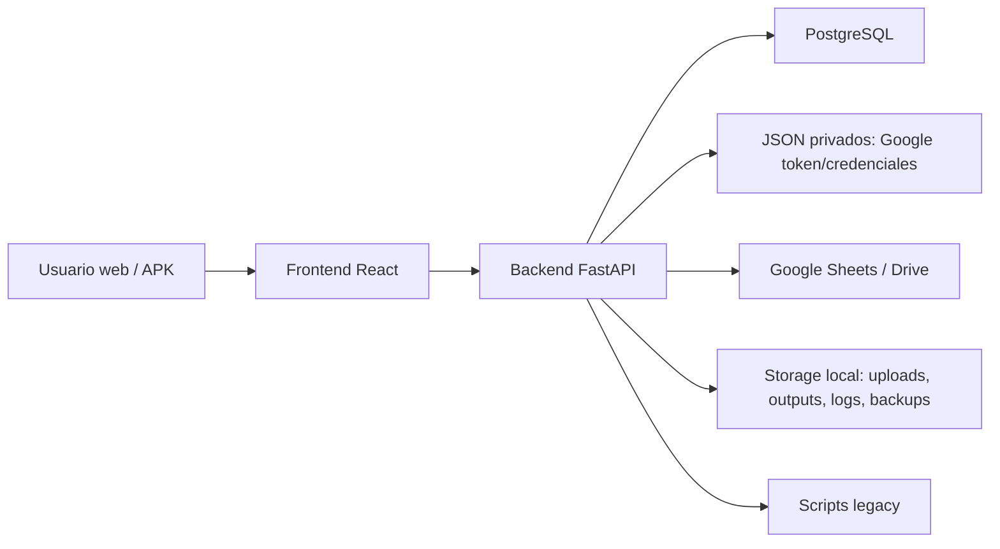
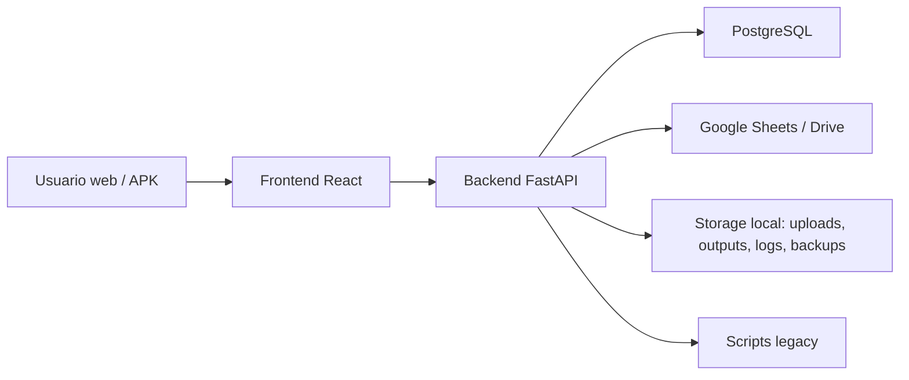

# Guia del proyecto - ElectroGV

## Resumen ejecutivo

ElectroGV es una plataforma web interna para centralizar procesos operativos
del grupo: garantias, remitos internos, ventas web, presupuestos, catalogo de
productos, precios y costos, recibos de sueldo, usuarios, roles, auditoria,
backups, notificaciones y herramientas legacy de Google Drive/Sheets.

La aplicacion nacio como una web interna con backend FastAPI y frontend React.
La Fase 2 esta llevando la persistencia a PostgreSQL, SQLAlchemy y Alembic.
Decision actual: no se migran datos de SQLite/JSON; el sistema debe funcionar
desde una base PostgreSQL limpia, creada con Alembic y seed inicial. El detalle
esta documentado en `docs/fase-2-postgres/`.

## Stack principal

| Capa | Tecnologia |
|---|---|
| Backend | FastAPI, Python 3.11, Uvicorn |
| Base activa | PostgreSQL 16 con SQLAlchemy 2.x y Alembic |
| Legacy descartado | SQLite/JSON locales, sin migracion de datos |
| Frontend | React 18, TypeScript, Vite, Tailwind, lucide-react |
| Mobile/PWA | Service worker, manifest, Capacitor Android |
| Integraciones | Google Sheets/OAuth, Firebase Cloud Messaging |
| Contenedores | Docker Compose con backend, Postgres, Adminer y backups |

## Arquitectura actual

El backend expone una API REST bajo `/api/*`. El frontend decide que pantallas
mostrar en base al token JWT, los permisos efectivos y el alcance de sucursal
del usuario.

## Arquitectura objetivo

La Fase 2 migra el acceso a datos a PostgreSQL con modelos SQLAlchemy,
migraciones Alembic y relaciones reales. La prioridad tecnica es que usuarios,
roles y datos transaccionales vivan en tablas normalizadas nuevas, sin importar
registros viejos de SQLite/JSON.

## Carpetas principales

| Ruta | Proposito |
|---|---|
| `backend/app/main.py` | Crea la app FastAPI, registra routers y sirve el frontend si existe `frontend/dist`. |
| `backend/app/routers/` | Endpoints por modulo. |
| `backend/app/database.py` | Helpers Postgres de compatibilidad para jobs/auditoria. |
| `backend/app/db.py` | Engine y sesiones SQLAlchemy para PostgreSQL. |
| `backend/app/models/` | Modelos ORM de la migracion a PostgreSQL. |
| `backend/app/users.py` | Fachada de usuarios/roles que delega en PostgreSQL. |
| `backend/app/permissions.py` | Catalogo de permisos y roles por defecto. |
| `backend/app/tools/` | Registro y runner de herramientas legacy. |
| `backend/legacy_scripts/` | Scripts originales adaptados para ejecucion web. |
| `backend/storage/` | Datos locales no-DB: privados OAuth, uploads, outputs, logs. No debe ir a git. |
| `frontend/src/App.tsx` | Rutas del frontend y controles de acceso. |
| `frontend/src/api/client.ts` | Cliente HTTP centralizado. |
| `frontend/src/pages/` | Pantallas funcionales. |
| `frontend/src/types/index.ts` | Tipos TypeScript compartidos por el frontend. |
| `docs/` | Documentacion del sistema. |
| `scripts_laptop/` | Scripts historicos para laptop local. |
| `docker-compose.yml` | Stack Docker actual. |

## Modulos funcionales

| Modulo | Rutas frontend | API principal |
|---|---|---|
| Inicio / Dashboard | `/` | `/api/system/*`, resumen de ventas, garantias y actividad |
| Auth y perfil | `/login`, `/set-password`, `/me`, `/mi-legajo` | `/api/auth/*`, `/api/employees/me/photo` |
| Garantias | `/warranties/*` | `/api/warranties/*` |
| Remitos de garantias | `/warranties/remitos`, `/warranties/remito-historial` | `/api/warranties/remitos/*` |
| Presupuestos | `/budgets/new` | `/api/budgets/*` |
| Ventas web | `/venta/*` | `/api/sales-web/*` |
| Inteligencia comercial | `/ventas-bi/*` | `/api/sales-bi/*` |
| Catalogo de productos | `/productos` | `/api/products/*` |
| Precios y costos | `/precios-costos` | `/api/price-cost-updates/*` |
| Recibos de sueldo | `/recibos` | `/api/payroll/*` |
| Herramientas legacy | `/tools`, `/tools/:toolId` | `/api/tools/*`, `/api/jobs/*` |
| Notificaciones | `/notificaciones` | `/api/notifications/*` |
| Administracion | `/administracion/*`, `/admin/*` | `/api/admin/*`, `/api/companies`, `/api/branches` |

## Autenticacion y permisos

El login devuelve un token y una sesion con usuario, roles, permisos, empresa,
sucursal principal, sucursales asignadas y flag `must_change_password`.

El frontend guarda la sesion en `localStorage` bajo:

- `electrogv_token`
- `electrogv_session`

Los permisos se definen en `backend/app/permissions.py`. Usuarios, roles y
alcance viven en las tablas `users`, `roles`, `user_roles` y `user_branches`.

## Datos persistentes

| Dato | Ubicacion actual |
|---|---|
| Base PostgreSQL | Docker volume `electrogv-pgdata` / VPS Postgres |
| Credenciales OAuth | `backend/storage/private/credentials.local.json` |
| Token OAuth | `backend/storage/private/token.json` |
| Logs de jobs | `backend/storage/logs/` |
| Uploads y recibos | `backend/storage/uploads/` |
| Outputs/exportaciones | `backend/storage/outputs/` |
| Backups app/DB | `backend/backups/` o `backend/storage/backups/`, segun flujo |

## Integraciones externas

- Google Sheets: garantias, catalogo de productos y presupuestos.
- Google Drive: scripts legacy y automatizaciones.
- Firebase Cloud Messaging: push mobile/web, mediante `firebase-admin`.
- Ngrok: exposicion local del backend cuando la app corre desde laptop.
- Render/Vercel: el README historico menciona despliegue de frontend; revisar
  la configuracion real vigente antes de tocar deploy.

## Estado tecnico observado

- El proyecto tiene cambios sin commitear relacionados con Docker, Postgres,
  Alembic, docs y helpers `.bat`.
- `backend/app/main.py` arranca sin bootstrap SQLite.
- `backend/app/db.py`, `backend/app/models/*` y Alembic baseline preparan SQLAlchemy/Postgres.
- `docker-compose.yml` ya incluye Postgres, Adminer y backup automatico.
- La documentacion por fases ya existe, pero faltaba una guia funcional y una
  referencia operativa central.
