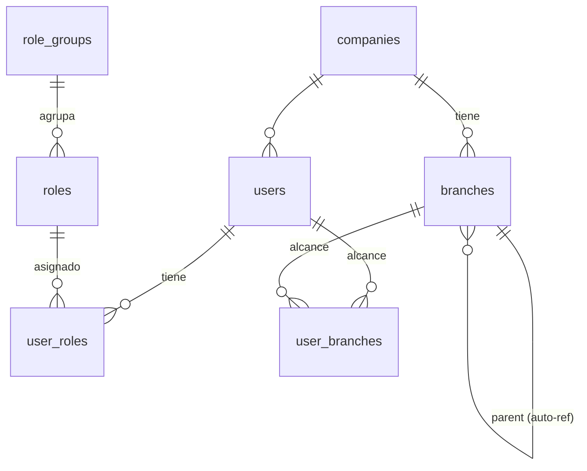
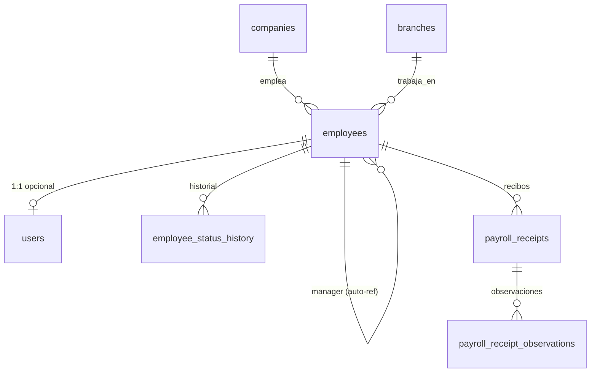
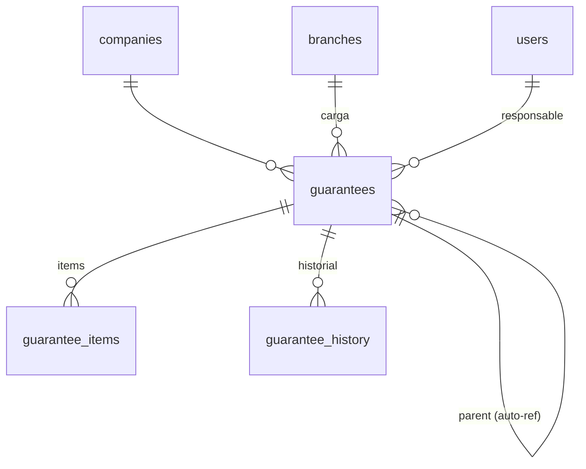
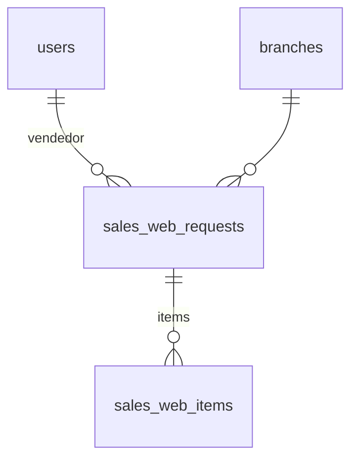
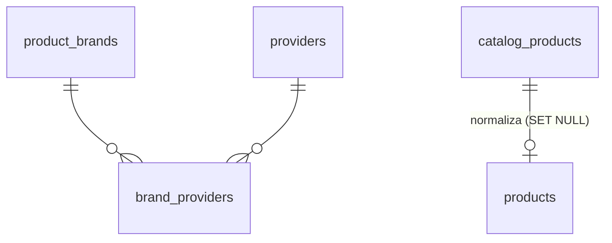
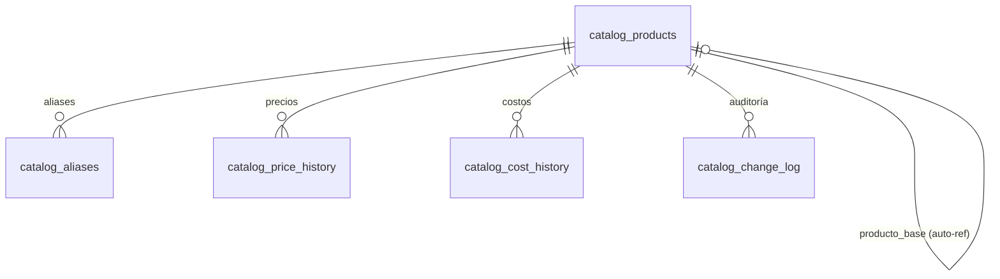
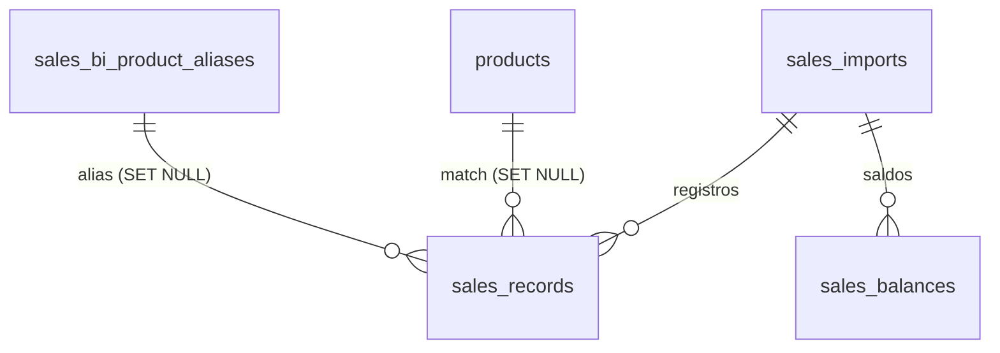
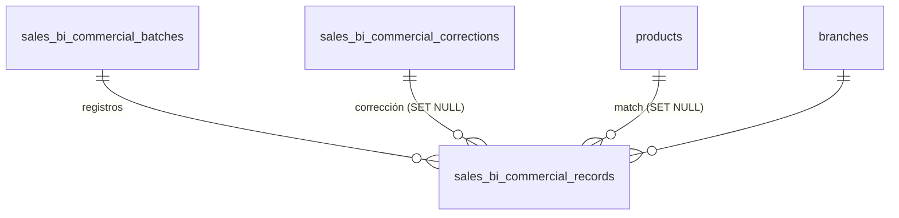
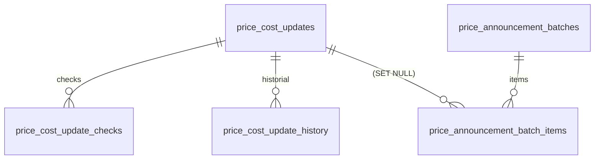

# 17 — Modelo de datos: MER + Normalización (ElectroGV)

> **Fuente de verdad:** los modelos SQLAlchemy en `backend/app/models/*.py`.
> Este doc se generó leyéndolos tabla por tabla (52 tablas). Reemplaza y amplía
> a `docs/fase-2-postgres/01-modelo-datos.md` (que cubría solo el núcleo inicial).
> Si cambia un modelo, actualizar acá.

PostgreSQL 16. **52 tablas** en 12 dominios.

---

## 1. Convenciones

| Tema | Convención |
|---|---|
| **PK transaccional** | `id BIGINT` autoincrement |
| **PK de referencia** | `companies` y `branches` usan **slug TEXT** (`electro_gv`, `caseros`): estable y legible |
| **PK especiales** | `jobs.id` = TEXT (id de ejecución); `guarantee_counters` = PK compuesta `(year, branch_code)` |
| **Claves naturales** | `UNIQUE` (`users.username`, `employees.dni`, `guarantees.warranty_code`, `branches.code`, `products.sku_normalized`, …) |
| **FKs** | siempre con índice. Política `ON DELETE`: **CASCADE** en hijos, **RESTRICT** en referencias maestras, **SET NULL** en vínculos opcionales |
| **Timestamps** | `created_at`/`updated_at` → `timestamptz` (default `now()`) |
| **Dinero** | `numeric(14,2)` |
| **Booleanos** | `boolean` |
| **Semi-estructurado** | `jsonb` (config, auditoría, snapshots regenerables) |
| **Estados** | `text` + validación en la app (no ENUM nativo, para evolucionar sin migración rígida) |
| **Naming** | `snake_case`; FK = `<entidad>_id`; columnas de match = `*_normalized`/`*_norm` |

**Política `ON DELETE` por tipo:**
- **CASCADE** — hijos que no existen sin el padre: `*_items`, `*_history`, `*_records`, `*_checks`, `*_observations`, `catalog_aliases`, `catalog_*_history`.
- **RESTRICT** — no borrar si hay dependencias: `companies`, `branches`, `roles`, `products` (en algunos hijos), `guarantees` (en `remito_items`).
- **SET NULL** — vínculo opcional: casi todos los `*_user_id` de auditoría, `branch_id` sueltos, `employees.user_id`, `roles.group_id`, `products.catalog_product_id`.

---

## 2. Mapa de dominios

| # | Dominio | Tablas |
|---|---|---|
| 1 | Organización & Acceso | companies, branches, users, role_groups, roles, user_roles, user_branches |
| 2 | RRHH | employees, employee_status_history, payroll_receipts, payroll_receipt_observations |
| 3 | Garantías | guarantees, guarantee_items, guarantee_history, guarantee_counters, guarantee_exports, guarantee_sync_logs |
| 4 | Remitos | remitos, remito_items |
| 5 | Ventas Web | sales_web_requests, sales_web_items |
| 6 | Productos (legacy) | products, product_brands, providers, brand_providers, product_sync_logs |
| 7 | Catálogo Maestro | catalog_products, catalog_aliases, catalog_price_history, catalog_cost_history, catalog_templates, catalog_abbreviations, catalog_change_log |
| 8 | Sales BI (operativo) | sales_imports, sales_records, sales_balances, sales_bi_product_aliases |
| 9 | Sales BI (comercial) | sales_bi_commercial_batches, sales_bi_commercial_records, sales_bi_commercial_corrections |
| 10 | PSI (planificación) | sales_psi_adjustments, psi_product_aliases |
| 11 | Precios & Anuncios | price_cost_updates, price_cost_update_checks, price_cost_update_history, price_announcement_batches, price_announcement_batch_items |
| 12 | Sistema & Notificaciones | notifications, push_subscriptions, fcm_tokens, jobs, app_events |

**`users` y `branches` son el centro de gravedad:** casi todo apunta a `users` (auditoría) y muchas tablas a `branches` (alcance).

---

## 3. Dominio 1 — Organización & Acceso



- **companies** `(PK slug)` — name · legal_name · cuit · is_active.
- **branches** `(PK slug)` — company_id→companies (RESTRICT) · code UNIQUE · type (`physical|web|deposit|admin`) · parent_branch_id→branches (SET NULL, auto-ref) · direccion · direccion_fiscal.
- **users** `(PK BIGINT)` — username UNIQUE · display_name · password_hash · is_active · must_change_password.
- **role_groups** `(PK BIGINT)` — name UNIQUE · label · sort_order. *Departamentos (Administración/Gerencia/Posventa/Encargados/Depósito/Ventas). Dimensión organizativa, no afecta permisos.*
- **roles** `(PK BIGINT)` — name UNIQUE · label · level · group_id→role_groups (SET NULL) · **permissions [jsonb]** (claves activas; el catálogo vive en `permissions.py`).
- **user_roles** *(N–N)* — user_id→users (CASCADE) · role_id→roles (RESTRICT) · is_primary · **UNIQUE(user_id, role_id)**.
- **user_branches** *(N–N = alcance operativo)* — user_id→users (CASCADE) · branch_id→branches (CASCADE) · is_primary · **UNIQUE(user_id, branch_id)**.

---

## 4. Dominio 2 — RRHH



- **employees** `(PK BIGINT)` — dni UNIQUE · user_id→users (SET NULL, **UNIQUE** → 1:1 opcional) · company_id→companies (RESTRICT) · work_branch_id→branches (RESTRICT) · manager_id→employees (SET NULL, auto-ref) · datos personales · `status` (`alta|licencia|baja`) · `photo_status`.
- **employee_status_history** `(PK BIGINT)` — employee_id→employees (CASCADE) · status/previous_status · motivo · fechas · actor_user_id→users (SET NULL).
- **payroll_receipts** `(PK BIGINT)` — employee_id→employees (RESTRICT) · period_year/period_month · file_* · `status` (`pendiente|firmado|observado|anulado`) · replaced_by_receipt_id→payroll_receipts (SET NULL, auto-ref) · varios *_user_id.
- **payroll_receipt_observations** `(PK BIGINT)` — receipt_id→payroll_receipts (CASCADE) · employee_id→employees (SET NULL) · message · status (`abierta|respondida`).

---

## 5. Dominio 3 — Garantías



- **guarantees** `(PK BIGINT)` — warranty_code UNIQUE · parent_id→guarantees (SET NULL, auto-ref) · company_id→companies (RESTRICT) · branch_id / sucursal_responsable_id→branches (RESTRICT) · responsible_user_id + varios *_user_id→users (SET NULL) · flujo (`status`, `review_status`, `ubicacion_actual`, `transit_status`) · datos proveedor / resolución / cliente.
- **guarantee_items** `(PK BIGINT)` — guarantee_id→guarantees (CASCADE) · item_index · producto/sku/marca/serie/falla.
- **guarantee_history** `(PK BIGINT)` — guarantee_id→guarantees (CASCADE) · actor_user_id→users (SET NULL) · action · old/new_status · **details [jsonb]**.
- **guarantee_counters** `(PK compuesta year + branch_code)` — last_number. *Numeración por año/sucursal; se asigna con `SELECT … FOR UPDATE`.*
- **guarantee_exports** `(PK BIGINT)` — created_by_user_id→users (SET NULL) · **warranty_ids [jsonb]** · **filters [jsonb]**.
- **guarantee_sync_logs** `(PK BIGINT)` — created_by_user_id→users (SET NULL) · **errors [jsonb]**.

---

## 6. Dominio 4 — Remitos

```mermaid
erDiagram
  remitos    ||--o{ remito_items : contiene
  guarantees ||--o{ remito_items : "está en"
  branches   ||--o{ remitos      : origen/destino
```

- **remitos** `(PK BIGINT)` — remito_code UNIQUE · tipo_remito (`sucursal_a_deposito|deposito_a_deposito|deposito_a_proveedor`) · origen/destino_branch_id→branches (RESTRICT) · `status` (`pendiente|en_transito|recibido|anulado`) · *_user_id→users.
- **remito_items** *(N–N remito ↔ garantía)* — remito_id→remitos (CASCADE) · guarantee_id→guarantees (RESTRICT) · **UNIQUE(remito_id, guarantee_id)**.

---

## 7. Dominio 5 — Ventas Web



- **sales_web_requests** `(PK BIGINT)` — numero_solicitud UNIQUE · vendedor_user_id→users (SET NULL) · branch_id→branches (SET NULL) · estado · datos cliente · costo_envio · fechas de workflow.
- **sales_web_items** `(PK BIGINT)` — request_id→sales_web_requests (CASCADE) · sku · producto · cantidad · precio_unitario · total_linea.

---

## 8. Dominio 6 — Productos (legacy)



- **products** `(PK BIGINT)` — sku · sku_normalized UNIQUE · marca + marca_normalized · tipo · pvp/costo_vigente [numeric] · is_active · **catalog_product_id→catalog_products (SET NULL)** *(único puente al maestro nuevo; NULL = aún no migrado)*.
- **product_brands** `(PK BIGINT)` — name · normalized_name UNIQUE.
- **providers** `(PK BIGINT)` — name · normalized_name UNIQUE · contacto.
- **brand_providers** *(N–N marca ↔ proveedor)* — brand_id→product_brands (CASCADE) · provider_id→providers (CASCADE) · is_default · **UNIQUE(brand_id, provider_id)**.
- **product_sync_logs** `(PK BIGINT)` — actor_user_id→users (SET NULL) · contadores · **errors [jsonb]**.

---

## 9. Dominio 7 — Catálogo Maestro



- **catalog_products** `(PK BIGINT)` — codigo_puma · sku_base · sku_comercial + sku_comercial_normalized · 4 descripciones (base/comercial/erp/original) · marca + marca_normalized · familia/rubro/subrubro_app (manda) · familia/rubro/subrubro_erp (referencia) · condicion (`PRIMERA|OUTLET`) · estado · activo · producto_base_id→catalog_products (SET NULL, auto-ref) · **datos [jsonb]** (orden de atributos + extras del armador) · *_by_user_id→users.
- **catalog_aliases** `(PK BIGINT)` — catalog_product_id→catalog_products (CASCADE) · sku_anterior · descripcion_anterior · origen · tipo_equivalencia · confianza.
- **catalog_price_history / catalog_cost_history** `(PK BIGINT)` — catalog_product_id→catalog_products (CASCADE) · pvp/costo [numeric] · fecha_desde · fecha_hasta (NULL=vigente).
- **catalog_templates** `(PK BIGINT)` — **UNIQUE(familia_app, rubro_app)** · **campos_obligatorios [jsonb]** · formatos de descripción.
- **catalog_abbreviations** `(PK BIGINT)` — **UNIQUE(texto_original)** · abreviatura_erp.
- **catalog_change_log** `(PK BIGINT)` — catalog_product_id→catalog_products (CASCADE) · campo · valor_anterior/nuevo · changed_by_user_id→users.

---

## 10. Dominio 8 — Sales BI (operativo)



- **sales_imports** `(PK BIGINT)` — fecha · sucursal (texto) · branch_id→branches (SET NULL) · tipo · fuente · status (`activo|anulado`) · totales por medio de pago [numeric] · imported_by_user_id→users · **warnings [jsonb]**.
- **sales_records** `(PK BIGINT)` — import_id→sales_imports (CASCADE) · remito · vendedor + vendedor_normalized · seller_user_id→users (SET NULL) · sku + sku_normalized · product_id→products (SET NULL) · product_alias_id→sales_bi_product_aliases (SET NULL) · product_match_status · categoria/linea/tipo_producto · cantidad · importes + medios de pago [numeric] · total_cobrado · saldo.
- **sales_bi_product_aliases** `(PK BIGINT)` — product_id→products (CASCADE) · alias_sku_norm / alias_desc_norm (uno o ambos) · *_raw.
- **sales_balances** `(PK BIGINT)` — import_id→sales_imports (CASCADE) · remito · montos por medio de pago.

---

## 11. Dominio 9 — Sales BI (comercial, Ventas vs Costos)



- **sales_bi_commercial_batches** `(PK BIGINT)` — source_kind · period_start/end · totales [numeric] · imported_by_user_id→users · **warnings [jsonb]**.
- **sales_bi_commercial_records** `(PK BIGINT)` — batch_id→batches (CASCADE) · fecha · sucursal + branch_id→branches (SET NULL) · marca_raw/tipo_raw/descripcion_raw/sku_raw + versiones normalizadas + categoria (derivada) · product_id→products (SET NULL) · correction_id→corrections (SET NULL) · match_status · cantidad/pvp/costo/diferencia/margen [numeric].
- **sales_bi_commercial_corrections** `(PK BIGINT)` — match_*_norm · corrected_* · product_id→products (SET NULL) · created_by_user_id→users.

---

## 12. Dominio 10 — PSI (planificación de ventas e inventario)

- **sales_psi_adjustments** `(PK BIGINT)` — product_id→products (RESTRICT) · **snapshots** (sku/marca/tipo/condicion/descripcion) · periodo_semana · sucursal · cantidad_delta · target (`sell_out|stock|both`) · status (`pending|applied_to_sheet|reverted|failed`) · varios *_user_id→users.
- **psi_product_aliases** `(PK BIGINT)` — product_id→products (CASCADE) · alias_sku_norm / alias_desc_norm (al menos uno; constraint en la migración) · *_raw.

---

## 13. Dominio 11 — Precios & Anuncios



- **price_cost_updates** `(PK BIGINT)` — product_id→products (SET NULL) · product_sync_log_id→product_sync_logs (SET NULL) · precios anterior/nuevo · archived_at / announcement_archived_at · *_user_id→users.
- **price_cost_update_checks** `(PK BIGINT)` — update_id→price_cost_updates (CASCADE) · check_key · **UNIQUE(update_id, check_key)**.
- **price_cost_update_history** `(PK BIGINT)` — update_id→price_cost_updates (CASCADE) · **detail [jsonb]**.
- **price_announcement_batches** `(PK BIGINT)` — **brand_names [jsonb]** · created_by_user_id→users.
- **price_announcement_batch_items** `(PK BIGINT)` — batch_id→batches (CASCADE) · update_id→price_cost_updates (SET NULL) · snapshot de sku/producto/marca/precio.

---

## 14. Dominio 12 — Sistema & Notificaciones

- **notifications** `(PK BIGINT)` — user_id→users (CASCADE) · type/module/priority · entity_type/entity_id · related_request_id→sales_web_requests (SET NULL) · branch_id→branches (SET NULL) · **metadata [jsonb]** · read.
- **push_subscriptions** `(PK BIGINT)` — user_id→users (CASCADE) · endpoint · **UNIQUE(user_id, endpoint)**.
- **fcm_tokens** `(PK BIGINT)` — user_id→users (CASCADE) · token.
- **jobs** `(PK TEXT)` — ejecuciones de herramientas · created_by_user_id→users (SET NULL) · **payload [jsonb]**.
- **app_events** `(PK BIGINT)` — auditoría · actor_user_id→users (SET NULL) · **detail [jsonb]**.

---

## 15. Normalización

### 15.1 Veredicto por forma normal

- **1FN (atomicidad / sin grupos repetidos).** ✅ en el núcleo relacional: no hay columnas CSV ni listas dentro de un campo escalar; las relaciones muchos-a-muchos están en tablas puente (`user_roles`, `user_branches`, `brand_providers`, `remito_items`). ⚠️ Las columnas **`jsonb`** (ver 15.2) son, en sentido estricto, no atómicas — pero son **denormalizaciones intencionales** para config/auditoría/snapshots, no datos a relacionar.
- **2FN (sin dependencias parciales de PK compuesta).** ✅ La única PK compuesta es `guarantee_counters (year, branch_code)`, y su único atributo (`last_number`) depende de la clave completa. El resto de las PK son simples (`id`), así que 2FN se cumple trivialmente.
- **3FN (sin dependencias transitivas).** ✅ en lo relacional: los atributos describen la entidad, no a otra entidad referenciada (la marca/sucursal de un producto/venta vive como FK, no se "arrastra" como dependencia obligatoria). Las columnas derivadas/duplicadas que existen son **a propósito** (15.2), no errores de diseño.

> Conclusión: el esquema está, en su parte relacional, en **3FN**. Las desviaciones son denormalizaciones deliberadas y acotadas, documentadas abajo.

### 15.2 Desnormalizaciones intencionales (y por qué)

| Patrón | Dónde | Motivo |
|---|---|---|
| **JSONB de configuración** | `roles.permissions`, `catalog_templates.campos_obligatorios`, `catalog_products.datos` | Estructura flexible que cambia sin migración. El "catálogo" de permisos vive en código; la plantilla y el armado de descripción son configurables por rubro/producto. |
| **JSONB de auditoría** | `guarantee_history.details`, `app_events.detail`, `price_cost_update_history.detail`, `product_sync_logs.errors`, `sales_imports.warnings`, `*_sync_logs.errors`, `jobs.payload`, `notifications.metadata` | Datos de evento/log heterogéneos. Normalizarlos sería sobre-ingeniería; nunca se consultan relacionalmente. |
| **Snapshots históricos** | `sales_psi_adjustments.*_snapshot`, `price_announcement_batch_items.*` (sku/producto/marca/precio), `sales_records`/`sales_bi_commercial_records` (marca/tipo/descripcion crudos) | El registro debe **sobrevivir** a cambios o baja del producto referenciado. Es denormalización a propósito para integridad histórica. |
| **Columnas `*_normalized` / `*_norm`** | `products.sku_normalized`, `*.marca_normalized`, aliases, records | Copia transformada (sin tildes/upper) del valor crudo, **indexada** para matching rápido. Dependencia funcional aceptada por performance. |
| **Totales pre-agregados** | `sales_imports.total_*`, `sales_bi_commercial_batches.total_*`, `guarantee_counters.last_number` | Se derivan de los hijos pero se guardan para lectura rápida / numeración atómica con `FOR UPDATE`. |
| **`warranty_ids` como JSONB** | `guarantee_exports.warranty_ids` | Decisión explícita de "no normalizar de más" — un export es un snapshot, no necesita tabla puente. |

### 15.3 Oportunidades / deuda a revisar (a futuro, no urgente)

1. **Tres mecanismos de alias** casi idénticos: `psi_product_aliases`, `sales_bi_product_aliases` y `catalog_aliases`. Mismos campos (`alias_sku_norm`, `alias_desc_norm`, raw). Candidatos a **unificar** en una tabla de aliases con `scope`/`origen` cuando el catálogo maestro reemplace a `products`.
2. **`sucursal` como TEXT suelto** conviviendo con `branch_id` (FK opcional) en `sales_imports`, `sales_records`, `sales_psi_adjustments`. Es legado del nombre de planilla ("Caseros", "Sur"); el canónico debería ser `branch_id`. Mantener el texto solo como snapshot de origen.
3. **`products` (legacy) vs `catalog_products` (maestro)** conviven durante la transición (`products.catalog_product_id`). Al completarse el corte, varias FK que hoy apuntan a `products` deberían repuntar a `catalog_products`.
4. **`numeric` vs snapshots de texto de precio** (`products.pvp_text`/`costo_text`): el texto crudo se guarda por trazabilidad de la planilla; el dato operativo es el `numeric`.

Ninguna de estas es un problema de correctitud — son decisiones conscientes de la transición. Se documentan para no confundir "denormalización intencional" con "deuda".
