# 18 — Diccionario de datos detallado (ElectroGV)

> **Fuente de verdad:** los modelos SQLAlchemy en `backend/app/models/*.py`.
> Complementa a [`17-modelo-datos-mer.md`](17-modelo-datos-mer.md) (visión MER +
> normalización) con el **detalle campo por campo** de cada tabla y un **diagrama
> ER en SVG por dominio**. Si cambia un modelo, actualizar acá.

**Cómo leer las tablas:** `Null` = la columna admite NULL · `Default` = valor por
defecto · `Clave` = PK / FK→destino (política ON DELETE) / UNIQUE / IDX (índice).
Tipos: `bigint`, `text`, `bool`, `int`, `numeric(14,2)`, `date`, `timestamptz`,
`jsonb`, `float`. Todas las tablas con `id bigint` lo tienen como PK autoincrement
salvo que se indique otra cosa.

**Estado de este documento:** ✅ Completo — los 12 dominios (52 tablas).

Índice de dominios: 1 Organización & Acceso · 2 RRHH · 3 Garantías · 4 Remitos ·
5 Ventas Web · 6 Productos · 7 Catálogo Maestro · 8 Sales BI operativo ·
9 Sales BI comercial · 10 PSI · 11 Precios & Anuncios · 12 Sistema.

---

## Dominio 1 — Organización & Acceso

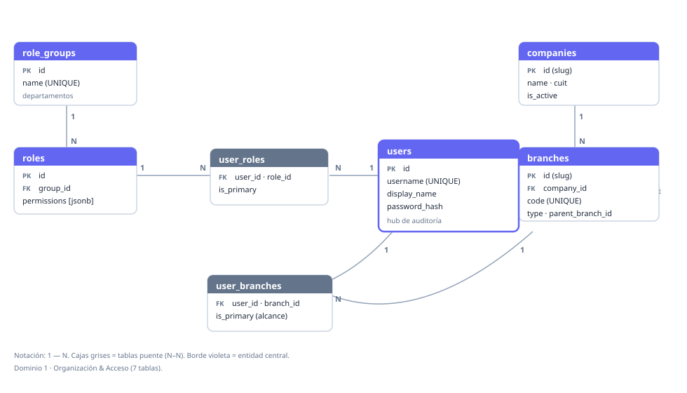

### companies
| Columna | Tipo | Null | Default | Clave | Descripción |
|---|---|---|---|---|---|
| id | text | no | — | **PK** | Slug legible (`electro_gv`). |
| name | text | no | — | | Nombre comercial. |
| legal_name | text | no | `''` | | Razón social. |
| cuit | text | no | `''` | | CUIT. |
| is_active | bool | no | `true` | | Activa. |
| created_at / updated_at | timestamptz | no | `now()` | | Auditoría. |

### branches
| Columna | Tipo | Null | Default | Clave | Descripción |
|---|---|---|---|---|---|
| id | text | no | — | **PK** | Slug (`caseros`). |
| company_id | text | no | — | FK→companies (RESTRICT), IDX | Empresa dueña. |
| name | text | no | — | | Nombre. |
| code | text | no | — | UNIQUE | Código corto. |
| type | text | no | `physical` | IDX | `physical|web|deposit|admin`. |
| parent_branch_id | text | sí | — | FK→branches (SET NULL), IDX | Sucursal padre (auto-ref). |
| direccion | text | no | `''` | | Dirección física. |
| direccion_fiscal | text | no | `''` | | Dirección de facturación. |
| is_active | bool | no | `true` | | Activa. |
| created_at / updated_at | timestamptz | no | `now()` | | Auditoría. |

### users
| Columna | Tipo | Null | Default | Clave | Descripción |
|---|---|---|---|---|---|
| id | bigint | no | auto | **PK** | |
| username | text | no | — | UNIQUE | Login. |
| display_name | text | no | — | | Nombre visible. |
| password_hash | text | no | `''` | | Hash. |
| is_active | bool | no | `true` | | Habilitado. |
| must_change_password | bool | no | `false` | | Forzar cambio. |
| created_at / updated_at | timestamptz | no | `now()` | | Auditoría. |

### role_groups *(departamentos)*
| Columna | Tipo | Null | Default | Clave | Descripción |
|---|---|---|---|---|---|
| id | bigint | no | auto | **PK** | |
| name | text | no | — | UNIQUE | Clave (`ADMINISTRACION`). |
| label | text | no | — | | Visible (`Administración`). |
| sort_order | int | no | `0` | | Orden de muestra. |
| created_at / updated_at | timestamptz | no | `now()` | | Auditoría. |

### roles
| Columna | Tipo | Null | Default | Clave | Descripción |
|---|---|---|---|---|---|
| id | bigint | no | auto | **PK** | |
| name | text | no | — | UNIQUE | Clave del rol. |
| label | text | no | — | | Visible. |
| level | int | no | `0` | | Jerarquía. |
| group_id | bigint | sí | — | FK→role_groups (SET NULL), IDX | Departamento. |
| permissions | jsonb | no | `[]` | | Lista de claves de permiso activas (catálogo en `permissions.py`). |
| created_at / updated_at | timestamptz | no | `now()` | | Auditoría. |

### user_roles *(N–N usuario ↔ rol)*
| Columna | Tipo | Null | Default | Clave | Descripción |
|---|---|---|---|---|---|
| id | bigint | no | auto | **PK** | |
| user_id | bigint | no | — | FK→users (CASCADE), IDX | |
| role_id | bigint | no | — | FK→roles (RESTRICT), IDX | |
| is_primary | bool | no | `false` | | Rol principal. |
| created_at | timestamptz | no | `now()` | | |
| | | | | **UNIQUE(user_id, role_id)** | |

### user_branches *(N–N = alcance operativo)*
| Columna | Tipo | Null | Default | Clave | Descripción |
|---|---|---|---|---|---|
| id | bigint | no | auto | **PK** | |
| user_id | bigint | no | — | FK→users (CASCADE), IDX | |
| branch_id | text | no | — | FK→branches (CASCADE), IDX | |
| is_primary | bool | no | `false` | | Sucursal principal. |
| created_at | timestamptz | no | `now()` | | |
| | | | | **UNIQUE(user_id, branch_id)** | |

---

## Dominio 2 — RRHH

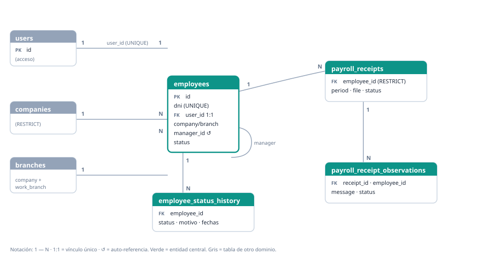

### employees
| Columna | Tipo | Null | Default | Clave | Descripción |
|---|---|---|---|---|---|
| id | bigint | no | auto | **PK** | |
| dni | text | sí | — | UNIQUE | DNI. |
| user_id | bigint | sí | — | FK→users (SET NULL), **UNIQUE**, IDX | Vínculo 1:1 con usuario. |
| first_name / last_name / display_name | text | no | `''` | | Identidad. |
| birthdate | date | sí | — | | |
| gender / civil_status | text | no | `''` | | |
| company_id | text | sí | — | FK→companies (RESTRICT), IDX | |
| branch_id | text | sí | — | FK→branches (RESTRICT), IDX | Sucursal asignada. |
| work_branch_id | text | sí | — | FK→branches (RESTRICT), IDX | Sucursal donde trabaja. |
| manager_id | bigint | sí | — | FK→employees (SET NULL), IDX | Jefe (auto-ref). |
| position / department / contract_type | text | no | `''` | | |
| hire_date | date | sí | — | | Alta. |
| phone / personal_email / address | text | no | `''` | | Contacto. |
| photo_url | text | no | `''` | | |
| photo_status | text | no | `sin_foto` | | `sin_foto|pendiente_aprobacion|solicitada_nuevamente|aprobada|rechazada`. |
| photo_uploaded_at | timestamptz | sí | — | | |
| status | text | no | `alta` | IDX | `alta|licencia|baja`. |
| created_at / updated_at | timestamptz | no | `now()` | | |

### employee_status_history
| Columna | Tipo | Null | Default | Clave | Descripción |
|---|---|---|---|---|---|
| id | bigint | no | auto | **PK** | |
| employee_id | bigint | no | — | FK→employees (CASCADE), IDX | |
| status / previous_status | text | no | `''`* | | *status NOT NULL sin default. |
| motivo / categoria | text | no | `''` | | |
| fecha_desde / fecha_hasta | date | sí | — | | |
| observaciones | text | no | `''` | | |
| actor_user_id | bigint | sí | — | FK→users (SET NULL) | Quién lo cambió. |
| created_at | timestamptz | no | `now()` | | |

### payroll_receipts
| Columna | Tipo | Null | Default | Clave | Descripción |
|---|---|---|---|---|---|
| id | bigint | no | auto | **PK** | |
| employee_id | bigint | no | — | FK→employees (RESTRICT), IDX | |
| period_year / period_month | int | no | — | | Período. |
| receipt_type | text | no | `mensual` | | |
| file_path / file_name | text | no | — | | Archivo. |
| file_content_type / file_hash | text | no | `''` | | |
| file_size | bigint | no | `0` | | |
| status | text | no | `pendiente` | IDX | `pendiente|firmado|observado|anulado`. |
| uploaded_by / viewed_by / signed_by / cancelled_by _user_id | bigint | sí | — | FK→users (SET NULL) | Actores. |
| viewed_at / signed_at / observed_at / cancelled_at | timestamptz | sí | — | | |
| cancel_reason | text | no | `''` | | |
| replaced_by_receipt_id | bigint | sí | — | FK→payroll_receipts (SET NULL) | Versión que lo reemplaza (auto-ref). |
| created_at / updated_at | timestamptz | no | `now()` | | |

### payroll_receipt_observations
| Columna | Tipo | Null | Default | Clave | Descripción |
|---|---|---|---|---|---|
| id | bigint | no | auto | **PK** | |
| receipt_id | bigint | no | — | FK→payroll_receipts (CASCADE), IDX | |
| employee_id | bigint | sí | — | FK→employees (SET NULL), IDX | |
| message | text | no | — | | Observación. |
| status | text | no | `abierta` | IDX | `abierta|respondida`. |
| answered_at | timestamptz | sí | — | | |
| answered_by_user_id | bigint | sí | — | FK→users (SET NULL) | |
| answer_message | text | no | `''` | | Respuesta de RRHH. |
| created_at | timestamptz | no | `now()` | | |

---

## Dominio 3 — Garantías

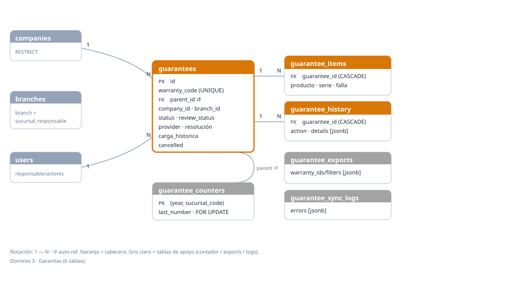

### guarantees *(cabecera; ~80 columnas, agrupadas por sección)*
| Sección | Columnas (tipo) | Notas |
|---|---|---|
| Identidad | id `bigint` **PK** · warranty_code `text` **UNIQUE** · parent_id `bigint` FK→guarantees (SET NULL, auto-ref) · parent_item_index `int` | Agrupación madre/hijo. |
| Organización | company_id `text` **FK→companies (RESTRICT, NOT NULL)** · branch_id / sucursal_responsable_id `text` FK→branches (RESTRICT) · sucursal · sucursal_code (IDX) · deposito · lugar_llegada `text` | Los `*_id` son canónicos; los textos son legacy de display. |
| Estado/flujo | status (`1 - INGRESO`) · review_status (`pendiente_revision`) · tipo_ingreso · origen_ingreso · ubicacion_actual · transit_status `text` (varios IDX) | Validados en la app, no ENUM. |
| Revisión | reviewed_by / review_started_by / correction_requested_by / correction_resubmitted_by `_user_id` FK→users (SET NULL) + sus `*_at timestamptz` · review_note `text` | |
| Responsable | responsible_user_id · created_by_user_id · updated_by_user_id FK→users (SET NULL) | |
| Fechas | ingreso_at (IDX) · created_at · updated_at (IDX) `timestamptz` | |
| Cliente | cliente_nombre · cliente_telefono · cliente_email · numero_factura `text` · fecha_compra `date` | Opcionales. |
| Proveedor | provider_name (IDX) · provider_case_id · provider_response_type (`retiro|revision|correccion`) · provider_correction_note `text` · sent_to_provider_at / last_provider_response_at / last_claim_at / … `timestamptz` | |
| Retiro/logística | estado_retiro_proveedor (`sin_solicitud`) · remito_proveedor · remito_interno · lugar_salida_transito `text` · varias fechas `timestamptz` | |
| Carga histórica | carga_historica `bool` (IDX) | Migración pre-sistema; fechas editables con `warranties.edit_dates`. |
| Resolución | resultado_resolucion · resolution_note · numero_nota_credito · producto_reemplazo · sku_reemplazo `text` · importe_nota_credito `numeric(14,2)` · fecha_resolucion/fecha_nota_credito/… `date/timestamptz` | |
| Export ENV | shipment_code (IDX) · shipment_file_name `text` | Lote al proveedor. |
| Observaciones | observations · photos_reference `text` | |
| Cancelación | cancelled `bool` (IDX) · cancel_reason `text` · cancelled_by_user_id FK→users (SET NULL) · cancelled_at `timestamptz` | |
| Google Sheets | synced_to_google_sheet `bool` · google_sheet_row_id `text` · last_google_sync_at `timestamptz` · sync_error `text` | Mirror al Sheet. |

### guarantee_items
| Columna | Tipo | Null | Default | Clave | Descripción |
|---|---|---|---|---|---|
| id | bigint | no | auto | **PK** | |
| guarantee_id | bigint | no | — | FK→guarantees (CASCADE), IDX | |
| item_index | int | no | `1` | | Orden. |
| producto / tipo / serie / falla / observaciones / correction_note | text | no | `''` | | |
| sku / marca | text | no | `''` | IDX | |
| created_at / updated_at | timestamptz | no | `now()` | | |

### guarantee_history
| Columna | Tipo | Null | Default | Clave | Descripción |
|---|---|---|---|---|---|
| id | bigint | no | auto | **PK** | |
| guarantee_id | bigint | no | — | FK→guarantees (CASCADE), IDX | |
| warranty_code | text | no | `''` | IDX | Redundante (snapshot). |
| action | text | no | — | | Evento. |
| old_status / new_status / field_name / old_value / new_value / note | text | no | `''` | | |
| details | jsonb | no | `{}` | | Detalle del evento. |
| actor_user_id | bigint | sí | — | FK→users (SET NULL) | |
| created_at | timestamptz | no | `now()` | IDX | |

### guarantee_counters *(numeración)*
| Columna | Tipo | Null | Default | Clave | Descripción |
|---|---|---|---|---|---|
| year | int | no | — | **PK (compuesta)** | |
| sucursal_code | text | no | — | **PK (compuesta)** | |
| last_number | int | no | `0` | | Último número. Avance con `SELECT … FOR UPDATE`. |
| updated_at | timestamptz | no | `now()` | | |

### guarantee_exports
| Columna | Tipo | Null | Default | Clave | Descripción |
|---|---|---|---|---|---|
| id | bigint | no | auto | **PK** | |
| created_by_user_id | bigint | sí | — | FK→users (SET NULL) | |
| provider_name | text | no | `''` | IDX | |
| marca | text | no | `''` | | |
| warranty_ids | jsonb | no | `[]` | | Lista de warranty_codes del lote (denormalizado a propósito). |
| filters | jsonb | no | `{}` | | Filtros usados. |
| file_path / file_name | text | no | — | | |
| file_format (`excel`) · logo_brand · shipment_code · punto_retiro · tipo_retiro · respuesta_proveedor_pickup | text | no | varios | | Metadatos de export/retiro. |
| row_count | int | no | `0` | | |
| fecha_retiro_acordada | timestamptz | sí | — | | |
| pickup_alert_sent | bool | no | `false` | | |
| created_at | timestamptz | no | `now()` | IDX | |

### guarantee_sync_logs
| Columna | Tipo | Null | Default | Clave | Descripción |
|---|---|---|---|---|---|
| id | bigint | no | auto | **PK** | |
| sync_type | text | no | — | IDX | |
| status | text | no | — | | |
| actor_user_id | bigint | sí | — | FK→users (SET NULL) | |
| started_at | timestamptz | no | — | IDX | |
| finished_at | timestamptz | sí | — | | |
| rows_processed / rows_created / rows_updated / rows_skipped | int | no | `0` | | |
| errors | jsonb | no | `[]` | | |

---

## Dominio 4 — Remitos

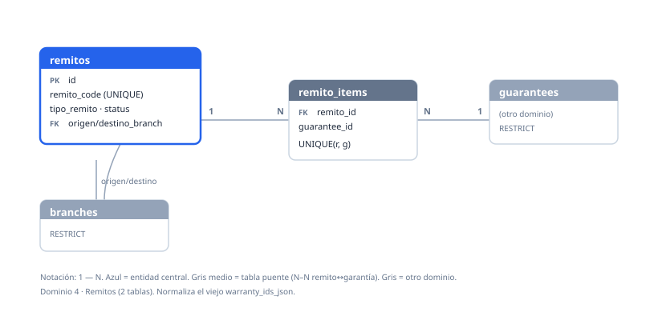

### remitos
| Columna | Tipo | Null | Default | Clave | Descripción |
|---|---|---|---|---|---|
| id | bigint | no | auto | **PK** | |
| remito_code | text | no | — | UNIQUE | |
| shipment_code | text | no | `''` | IDX | |
| tipo_remito | text | no | `sucursal_a_deposito` | IDX | `sucursal_a_deposito|deposito_a_deposito|deposito_a_proveedor`. |
| company_brand | text | no | `gv_electro` | | |
| origen_branch_id / destino_branch_id | text | sí | — | FK→branches (RESTRICT), IDX | Origen/destino. |
| origen_sucursal / destino_deposito | text | no | `''` | | Legacy de display. |
| proveedor | text | no | `''` | | Para remito a proveedor. |
| status | text | no | `pendiente` | IDX | `pendiente|en_transito|recibido|anulado`. |
| nota / pdf_path | text | no | `''` | | |
| created_by / despachado_por / recibido_por `_user_id` | bigint | sí | — | FK→users (SET NULL) | Workflow. |
| created_at (IDX) / fecha_despacho / fecha_llegada | timestamptz | — | `now()`/— | | |

### remito_items *(N–N remito ↔ garantía)*
| Columna | Tipo | Null | Default | Clave | Descripción |
|---|---|---|---|---|---|
| id | bigint | no | auto | **PK** | |
| remito_id | bigint | no | — | FK→remitos (CASCADE), IDX | |
| guarantee_id | bigint | no | — | FK→guarantees (RESTRICT), IDX | |
| created_at | timestamptz | no | `now()` | | |
| | | | | **UNIQUE(remito_id, guarantee_id)** | Normaliza el viejo `warranty_ids_json`. |

---

## Dominio 5 — Ventas Web

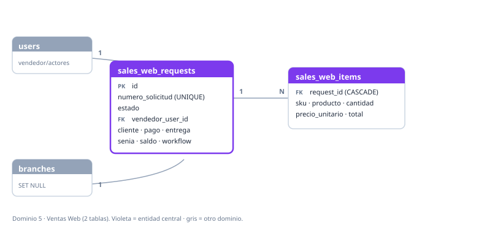

### sales_web_requests
| Columna | Tipo | Null | Default | Clave | Descripción |
|---|---|---|---|---|---|
| id | bigint | no | auto | **PK** | |
| numero_solicitud | text | no | — | UNIQUE | |
| numero_remito_prefactura | text | no | `''` | | |
| estado | text | no | — | IDX | `pendiente|tomado|completado|enviado|cancelado`. |
| vendedor_user_id | bigint | sí | — | FK→users (SET NULL) | Vendedor. |
| vendedor_nombre | text | no | `''` | | Snapshot. |
| branch_id | text | sí | — | FK→branches (SET NULL), IDX | |
| sucursal / canal | text | no | `''` | | |
| dni / apellido_nombre / telefono / correo_electronico / domicilio / codigo_postal / localidad | text | no | — | | Cliente. |
| barrio / entre_calles / observaciones | text | no | `''` | | |
| pago_tipo / entrega_tipo | text | no | — | | |
| costo_envio / senia_monto / saldo_restante | numeric(14,2) | sí | — | | |
| observacion_admin / cancel_reason | text | no | `''` | | |
| taken_by / completed_by / sent_to_sales_by / cancelled_by `_user_id` | bigint | sí | — | FK→users (SET NULL) | Workflow. |
| created_at (IDX) / updated_at / taken_at / completed_at / sent_to_sales_at / cancelled_at | timestamptz | — | `now()`/— | | |

### sales_web_items
| Columna | Tipo | Null | Default | Clave | Descripción |
|---|---|---|---|---|---|
| id | bigint | no | auto | **PK** | |
| request_id | bigint | no | — | FK→sales_web_requests (CASCADE), IDX | |
| sku / marca / tipo / condicion | text | no | `''` | | |
| producto | text | no | — | | |
| cantidad | int | no | `1` | | |
| precio_unitario / total_linea | numeric(14,2) | sí | — | | |

---

## Dominio 6 — Productos (legacy)

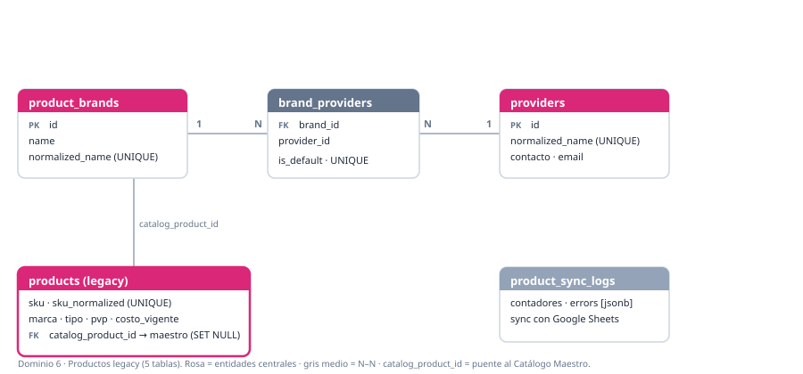

### products
| Columna | Tipo | Null | Default | Clave | Descripción |
|---|---|---|---|---|---|
| id | bigint | no | auto | **PK** | |
| sku | text | no | — | | SKU crudo. |
| sku_normalized | text | no | — | UNIQUE | Clave de match. |
| marca / descripcion / condicion_producto / search_text / source_sheet | text | no | `''` | | |
| marca_normalized | text | no | `''` | IDX | |
| tipo | text | no | `''` | IDX | |
| pvp / costo_vigente | numeric(14,2) | sí | — | | |
| pvp_text / costo_text | text | no | `''` | | Snapshot textual de la planilla. |
| source_row | int | sí | — | | |
| is_active | bool | no | `true` | IDX | |
| last_synced_at | timestamptz | sí | — | | |
| catalog_product_id | bigint | sí | — | FK→catalog_products (SET NULL), IDX | **Puente al maestro nuevo.** |
| created_at / updated_at | timestamptz | no | `now()` | | |

### product_brands
| Columna | Tipo | Null | Default | Clave | Descripción |
|---|---|---|---|---|---|
| id | bigint | no | auto | **PK** | |
| name | text | no | — | | |
| normalized_name | text | no | — | UNIQUE | |
| is_active | bool | no | `true` | IDX | |
| created_at / updated_at | timestamptz | no | `now()` | | |

### providers
| Columna | Tipo | Null | Default | Clave | Descripción |
|---|---|---|---|---|---|
| id | bigint | no | auto | **PK** | |
| name | text | no | — | | |
| normalized_name | text | no | — | UNIQUE | |
| contact_name / email / phone / notes | text | no | `''` | | |
| is_active | bool | no | `true` | IDX | |
| created_at / updated_at | timestamptz | no | `now()` | | |

### brand_providers *(N–N marca ↔ proveedor)*
| Columna | Tipo | Null | Default | Clave | Descripción |
|---|---|---|---|---|---|
| id | bigint | no | auto | **PK** | |
| brand_id | bigint | no | — | FK→product_brands (CASCADE), IDX | |
| provider_id | bigint | no | — | FK→providers (CASCADE), IDX | |
| is_default | bool | no | `true` | | Proveedor por defecto. |
| created_at / updated_at | timestamptz | no | `now()` | | |
| | | | | **UNIQUE(brand_id, provider_id)** | |

### product_sync_logs
| Columna | Tipo | Null | Default | Clave | Descripción |
|---|---|---|---|---|---|
| id | bigint | no | auto | **PK** | |
| source | text | no | `google_sheet` | | |
| status | text | no | — | | |
| actor_user_id | bigint | sí | — | FK→users (SET NULL) | |
| started_at | timestamptz | no | — | IDX | |
| finished_at | timestamptz | sí | — | | |
| rows_processed/created/updated/skipped · brands_created · price/cost_changes_detected · price_cost_updates_created/skipped | int | no | `0` | | Contadores. |
| errors | jsonb | no | `[]` | | |
| spreadsheet_id / sheet_name | text | no | `''` | | |

---

## Dominio 7 — Catálogo Maestro

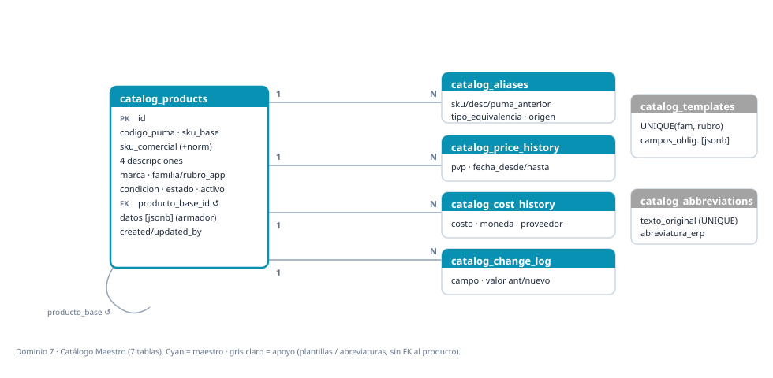

### catalog_products *(maestro nuevo)*
| Columna | Tipo | Null | Default | Clave | Descripción |
|---|---|---|---|---|---|
| id | bigint | no | auto | **PK** | |
| codigo_puma | text | no | `''` | IDX | Manual. |
| sku_base / sku_comercial | text | no | `''` | | |
| sku_comercial_normalized | text | no | `''` | IDX | |
| descripcion_base / descripcion_comercial / descripcion_erp / descripcion_original | text | no | `''` | | 4 descripciones derivadas. |
| marca | text | no | `''` | | |
| marca_normalized | text | no | `''` | IDX | |
| familia_app / rubro_app | text | no | `''` | IDX | Clasificación comercial (manda). |
| subrubro_app · familia_erp · rubro_erp · subrubro_erp | text | no | `''` | | ERP = referencia. |
| condicion | text | no | `PRIMERA` | IDX | `PRIMERA|OUTLET`. |
| estado | text | no | `BORRADOR` | IDX | BORRADOR…ACTIVO…DISCONTINUADO. |
| activo | bool | no | `false` | IDX | |
| producto_base_id | bigint | sí | — | FK→catalog_products (SET NULL) | Base del outlet (auto-ref). |
| datos | jsonb | no | `{}` | | Armado de la descripción (orden + extras). |
| created_by / updated_by `_user_id` | bigint | sí | — | FK→users (SET NULL) | |
| created_at / updated_at | timestamptz | no | `now()` | | |

### catalog_aliases
| Columna | Tipo | Null | Default | Clave | Descripción |
|---|---|---|---|---|---|
| id | bigint | no | auto | **PK** | |
| catalog_product_id | bigint | no | — | FK→catalog_products (CASCADE), IDX | |
| sku_anterior | text | no | `''` | IDX | |
| descripcion_anterior / codigo_puma_anterior / origen / tipo_equivalencia / observacion | text | no | `''` | | |
| confianza | int | no | `100` | | |
| revisado | bool | no | `false` | | |
| created_by_user_id | bigint | sí | — | FK→users (SET NULL) | |
| created_at | timestamptz | no | `now()` | | |

### catalog_price_history / catalog_cost_history
| Columna | Tipo | Null | Default | Clave | Descripción |
|---|---|---|---|---|---|
| id | bigint | no | auto | **PK** | |
| catalog_product_id | bigint | no | — | FK→catalog_products (CASCADE), IDX | |
| pvp *(price)* / costo *(cost)* | numeric(14,2) | no | — | | |
| moneda / proveedor *(solo cost)* | text | no | `ARS`/`''` | | |
| fecha_desde | date | no | — | | |
| fecha_hasta | date | sí | — | | NULL = vigente. |
| motivo | text | no | `''` | | |
| created_by_user_id | bigint | sí | — | FK→users (SET NULL) | |
| created_at | timestamptz | no | `now()` | | |

### catalog_templates
| Columna | Tipo | Null | Default | Clave | Descripción |
|---|---|---|---|---|---|
| id | bigint | no | auto | **PK** | |
| familia_app / rubro_app | text | no | `''` | **UNIQUE(familia_app, rubro_app)** | |
| campos_obligatorios | jsonb | no | `[]` | | Definición de campos por rubro. |
| formato_descripcion_base / comercial / erp / subrubro | text | no | `''` | | Patrones. |
| activo | bool | no | `true` | | |
| created_at / updated_at | timestamptz | no | `now()` | | |

### catalog_abbreviations
| Columna | Tipo | Null | Default | Clave | Descripción |
|---|---|---|---|---|---|
| id | bigint | no | auto | **PK** | |
| texto_original | text | no | — | **UNIQUE** | |
| abreviatura_erp | text | no | — | | |
| activo | bool | no | `true` | | |
| created_at | timestamptz | no | `now()` | | |

### catalog_change_log
| Columna | Tipo | Null | Default | Clave | Descripción |
|---|---|---|---|---|---|
| id | bigint | no | auto | **PK** | |
| catalog_product_id | bigint | no | — | FK→catalog_products (CASCADE), IDX | |
| campo | text | no | — | | |
| valor_anterior / valor_nuevo / motivo | text | no | `''` | | |
| changed_by_user_id | bigint | sí | — | FK→users (SET NULL) | |
| changed_at | timestamptz | no | `now()` | IDX | |

---

## Dominio 8 — Sales BI (operativo)

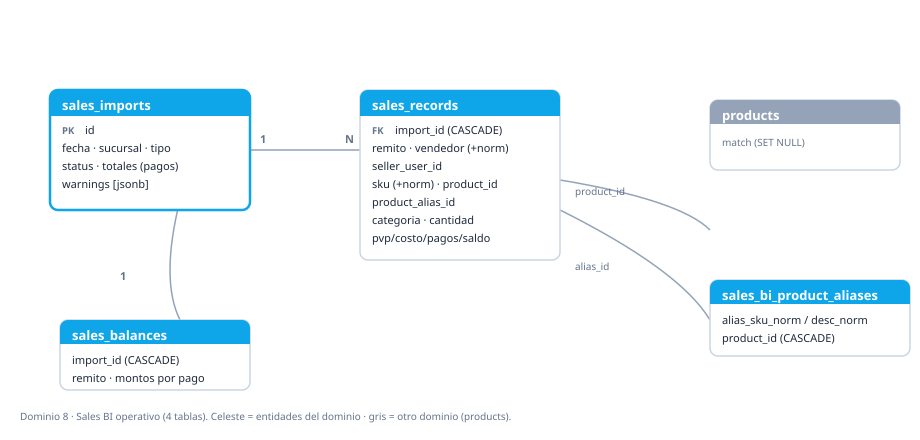

### sales_imports
| Columna | Tipo | Null | Default | Clave | Descripción |
|---|---|---|---|---|---|
| id | bigint | no | auto | **PK** | |
| fecha | date | no | — | IDX | |
| sucursal | text | no | — | IDX | Texto legacy. |
| branch_id | text | sí | — | FK→branches (SET NULL), IDX | Canónico. |
| tipo / fuente | text | no | — | | |
| fuente_url / fuente_nombre | text | no | `''` | | |
| status | text | no | `activo` | IDX | `activo|anulado`. |
| total_records | int | no | `0` | | |
| total_pvp / total_costo / total_efectivo / total_transferencia / total_tarjeta / total_usd / total_cuenta_corriente / total_otros | numeric(14,2) | no | `0` | | Totales pre-agregados por medio de pago. |
| cotizacion_dolar | numeric(14,2) | sí | — | | |
| imported_by / voided_by `_user_id` | bigint | sí | — | FK→users (SET NULL) | |
| created_at / voided_at | timestamptz | — | `now()`/— | | |
| void_reason | text | no | `''` | | |
| warnings | jsonb | no | `[]` | | |

### sales_records
| Columna | Tipo | Null | Default | Clave | Descripción |
|---|---|---|---|---|---|
| id | bigint | no | auto | **PK** | |
| import_id | bigint | no | — | FK→sales_imports (CASCADE), IDX | |
| nro_linea | int | no | — | | |
| remito / producto | text | no | `''` | | |
| vendedor | text | no | `''` | IDX | |
| vendedor_normalized | text | no | `''` | IDX | |
| seller_user_id | bigint | sí | — | FK→users (SET NULL), IDX | |
| sku | text | no | `''` | IDX | |
| sku_normalized | text | no | `''` | IDX | |
| product_id | bigint | sí | — | FK→products (SET NULL), IDX | Match. |
| product_alias_id | bigint | sí | — | FK→sales_bi_product_aliases (SET NULL), IDX | |
| product_match_status | text | no | `unmatched` | IDX | |
| marca / tipo_producto / condicion / categoria / linea | text | no | `''` | | Dimensiones (derivadas). |
| cantidad | int | no | `1` | | |
| pvp / costo / diferencia / margen_porcentaje / efectivo / transferencia / tarjeta / usd / cuenta_corriente / otros / total_cobrado / saldo | numeric(14,2) | no | `0` | | Importes y medios de pago. |

### sales_bi_product_aliases
| Columna | Tipo | Null | Default | Clave | Descripción |
|---|---|---|---|---|---|
| id | bigint | no | auto | **PK** | |
| product_id | bigint | no | — | FK→products (CASCADE), IDX | |
| alias_sku_norm / alias_desc_norm | text | sí | — | IDX | Uno o ambos. |
| alias_sku_raw / alias_desc_raw | text | no | `''` | | Snapshot. |
| created_by_user_id | bigint | sí | — | FK→users (SET NULL) | |
| created_at | timestamptz | no | `now()` | | |

### sales_balances
| Columna | Tipo | Null | Default | Clave | Descripción |
|---|---|---|---|---|---|
| id | bigint | no | auto | **PK** | |
| import_id | bigint | no | — | FK→sales_imports (CASCADE), IDX | |
| remito | text | no | `''` | | |
| efectivo / transferencia / tarjeta / usd / otros / total | numeric(14,2) | no | `0` | | Saldos por medio de pago. |

---

## Dominio 9 — Sales BI (comercial · Ventas vs Costos)

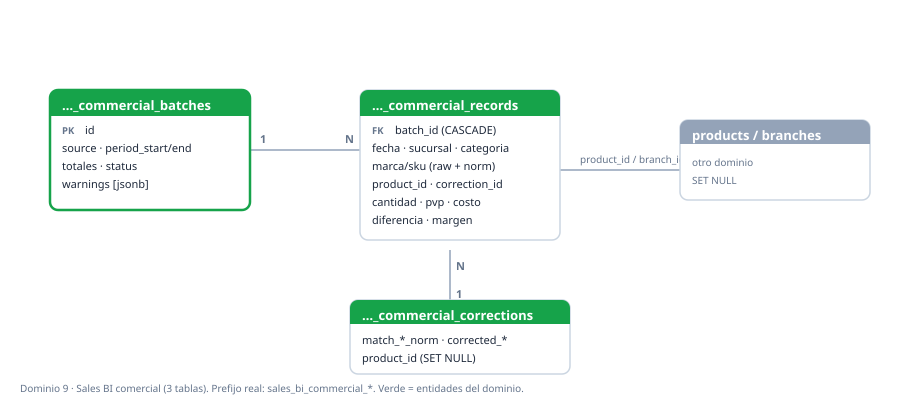

### sales_bi_commercial_batches
| Columna | Tipo | Null | Default | Clave | Descripción |
|---|---|---|---|---|---|
| id | bigint | no | auto | **PK** | |
| source_kind | text | no | `ventas_vs_costos` | IDX | |
| fuente_nombre / fuente_url | text | no | `''` | | |
| status | text | no | `activo` | IDX | |
| period_start / period_end | date | sí | — | IDX | |
| total_records / total_units | int | no | `0` | | |
| total_pvp / total_costo / total_diferencia | numeric(14,2) | no | `0` | | |
| imported_by / voided_by `_user_id` | bigint | sí | — | FK→users (SET NULL) | |
| created_at / voided_at | timestamptz | — | `now()`/— | | |
| void_reason | text | no | `''` | | |
| warnings | jsonb | no | `[]` | | |

### sales_bi_commercial_records
| Columna | Tipo | Null | Default | Clave | Descripción |
|---|---|---|---|---|---|
| id | bigint | no | auto | **PK** | |
| batch_id | bigint | no | — | FK→sales_bi_commercial_batches (CASCADE), IDX | |
| source_sheet | text | no | `''` | IDX | |
| row_number | int | no | `0` | | |
| fecha | date | no | — | IDX | |
| sucursal | text | no | — | IDX | |
| branch_id | text | sí | — | FK→branches (SET NULL), IDX | |
| tipo_venta | text | no | `''` | IDX | |
| marca_raw / tipo_raw / descripcion_raw / sku_raw | text | no | `''` | | Crudo de la planilla. |
| marca / tipo_producto / categoria | text | no | `''` | IDX | Normalizado / derivado. |
| descripcion | text | no | `''` | | |
| sku / sku_normalized / descripcion_normalized | text | no | `''` | IDX | |
| product_id | bigint | sí | — | FK→products (SET NULL), IDX | Match. |
| correction_id | bigint | sí | — | FK→sales_bi_commercial_corrections (SET NULL), IDX | |
| match_status | text | no | `unmatched` | IDX | |
| cantidad | int | no | `1` | | |
| pvp / costo / diferencia / margen_porcentaje | numeric(14,2) | no | `0` | | |

### sales_bi_commercial_corrections
| Columna | Tipo | Null | Default | Clave | Descripción |
|---|---|---|---|---|---|
| id | bigint | no | auto | **PK** | |
| match_sku_norm / match_desc_norm / match_brand_norm / match_type_norm | text | no | `''` | IDX | Claves de match. |
| corrected_sku / corrected_description / corrected_brand / corrected_type / note | text | no | `''` | | Corrección aplicada. |
| product_id | bigint | sí | — | FK→products (SET NULL), IDX | |
| created_by_user_id | bigint | sí | — | FK→users (SET NULL) | |
| created_at | timestamptz | no | `now()` | | |

---

## Dominio 10 — PSI (planificación de ventas e inventario)

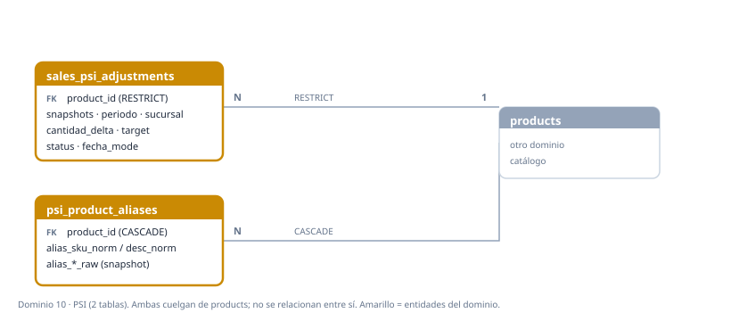

### sales_psi_adjustments
| Columna | Tipo | Null | Default | Clave | Descripción |
|---|---|---|---|---|---|
| id | bigint | no | auto | **PK** | |
| product_id | bigint | no | — | FK→products (RESTRICT), IDX | |
| sku_snapshot / marca_snapshot / tipo_snapshot / condicion_snapshot | text | no | — | | Snapshots (sobreviven a cambios). |
| descripcion_snapshot | text | no | `''` | | |
| periodo_semana | date | no | — | IDX | Semana del ajuste. |
| inserted_date | date | no | — | | |
| sucursal | text | no | — | IDX | `CASEROS|SUR|NORTE|CANNING`. |
| cantidad_delta | int | no | — | | + o − (≠0). |
| valor_estimado | numeric(14,2) | sí | — | | |
| reason | text | no | `''` | | |
| target | text | no | `sell_out` | | `sell_out|stock|both`. |
| fecha_mode | text | no | — | | `manual|random`. |
| status | text | no | `pending` | IDX | `pending|applied_to_sheet|reverted|failed`. |
| applied_at / reverted_at | timestamptz | sí | — | | |
| applied_to_book / applied_to_sheet_range | text | sí | — | | |
| applied_by / reverted_by / created_by `_user_id` | bigint | sí | — | FK→users (SET NULL) | |
| created_at (IDX) / updated_at | timestamptz | no | `now()` | | |

### psi_product_aliases
| Columna | Tipo | Null | Default | Clave | Descripción |
|---|---|---|---|---|---|
| id | bigint | no | auto | **PK** | |
| product_id | bigint | no | — | FK→products (CASCADE), IDX | |
| alias_sku_norm / alias_desc_norm | text | sí | — | IDX | Al menos uno (constraint en migración). |
| alias_sku_raw / alias_desc_raw | text | no | `''` | | Snapshot. |
| created_by_user_id | bigint | sí | — | FK→users (SET NULL) | |
| created_at | timestamptz | no | `now()` | | |

---

## Dominio 11 — Precios & Anuncios

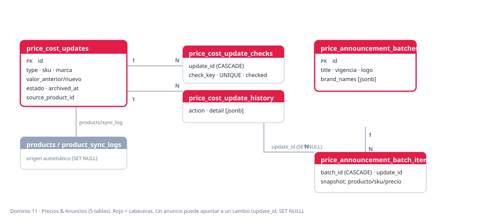

### price_cost_updates
| Columna | Tipo | Null | Default | Clave | Descripción |
|---|---|---|---|---|---|
| id | bigint | no | auto | **PK** | |
| type | text | no | — | IDX | `precio|costo`. |
| producto | text | no | — | | |
| sku | text | no | — | IDX | |
| marca | text | sí | — | | |
| valor_anterior | numeric(14,2) | sí | — | | |
| valor_nuevo | numeric(14,2) | no | — | | |
| estado | text | no | — | IDX | |
| lookup_warning | text | sí | — | | |
| created_by / cancelled_by / archived_by / announcement_archived_by `_user_id` | bigint | sí | — | FK→users (SET NULL) | |
| created_at (IDX) / updated_at / cancelled_at / archived_at (IDX) / announcement_archived_at (IDX) | timestamptz | — | `now()`/— | | |
| cancel_reason / archive_reason | text | sí | — | | |
| source | text | no | `''` | | Origen (sync). |
| source_product_id | bigint | sí | — | FK→products (SET NULL) | |
| source_sync_log_id | bigint | sí | — | FK→product_sync_logs (SET NULL) | |
| auto_created | bool | no | `false` | | |

### price_cost_update_checks
| Columna | Tipo | Null | Default | Clave | Descripción |
|---|---|---|---|---|---|
| id | bigint | no | auto | **PK** | |
| update_id | bigint | no | — | FK→price_cost_updates (CASCADE), IDX | |
| check_key / label | text | no | — | | |
| checked | bool | no | `false` | | |
| checked_by_user_id | bigint | sí | — | FK→users (SET NULL) | |
| checked_at | timestamptz | sí | — | | |
| | | | | **UNIQUE(update_id, check_key)** | |

### price_cost_update_history
| Columna | Tipo | Null | Default | Clave | Descripción |
|---|---|---|---|---|---|
| id | bigint | no | auto | **PK** | |
| update_id | bigint | no | — | FK→price_cost_updates (CASCADE), IDX | |
| action | text | no | — | | |
| detail | jsonb | sí | — | | |
| user_id | bigint | sí | — | FK→users (SET NULL) | |
| created_at | timestamptz | no | `now()` | | |

### price_announcement_batches
| Columna | Tipo | Null | Default | Clave | Descripción |
|---|---|---|---|---|---|
| id | bigint | no | auto | **PK** | |
| title / message / vigencia | text | no | `''` | | |
| logo_brand | text | no | `gv_electro` | | |
| brand_names | jsonb | no | `[]` | | Marcas del lote. |
| product_count / image_count | int | no | `0` | | |
| generated_by_user_id | bigint | sí | — | FK→users (SET NULL) | |
| generated_at | timestamptz | no | `now()` | IDX | |

### price_announcement_batch_items
| Columna | Tipo | Null | Default | Clave | Descripción |
|---|---|---|---|---|---|
| id | bigint | no | auto | **PK** | |
| batch_id | bigint | no | — | FK→price_announcement_batches (CASCADE), IDX | |
| update_id | bigint | sí | — | FK→price_cost_updates (SET NULL), IDX | |
| sort_order | int | no | `0` | | |
| type | text | no | `price` | | |
| producto / sku | text | no | — | | Snapshot. |
| marca | text | sí | — | | |
| valor_anterior | numeric(14,2) | sí | — | | |
| valor_nuevo | numeric(14,2) | no | — | | |
| change_kind | text | no | `NUEVO` | | |
| auto_created | bool | no | `false` | | |

---

## Dominio 12 — Sistema & Notificaciones

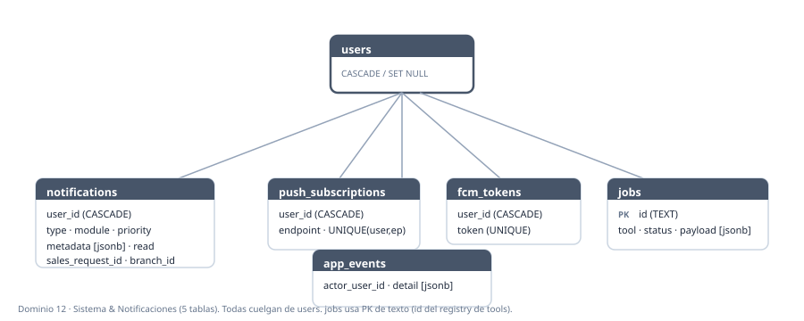

### notifications
| Columna | Tipo | Null | Default | Clave | Descripción |
|---|---|---|---|---|---|
| id | bigint | no | auto | **PK** | |
| user_id | bigint | no | — | FK→users (CASCADE), IDX | Destinatario. |
| title / message / type | text | no | — | | |
| module | text | no | `general` | IDX | |
| event_type | text | no | `general` | | |
| priority | text | no | `normal` | IDX | |
| entity_type / entity_id | text | sí | — | | Referencia genérica (no FK). |
| sales_request_id | bigint | sí | — | FK→sales_web_requests (SET NULL) | |
| link_url / branch_name / target_role / push_status | text | sí | — | | |
| branch_id | text | sí | — | FK→branches (SET NULL) | |
| metadata | jsonb | sí | — | | (columna `metadata`). |
| read | bool | no | `false` | | |
| read_at / delivered_push_at | timestamptz | sí | — | | |
| created_at | timestamptz | no | `now()` | IDX | |

### push_subscriptions
| Columna | Tipo | Null | Default | Clave | Descripción |
|---|---|---|---|---|---|
| id | bigint | no | auto | **PK** | |
| user_id | bigint | no | — | FK→users (CASCADE), IDX | |
| endpoint | text | no | — | | |
| p256dh / auth | text | sí | — | | Claves web-push. |
| created_at | timestamptz | no | `now()` | | |
| | | | | **UNIQUE(user_id, endpoint)** | |

### fcm_tokens
| Columna | Tipo | Null | Default | Clave | Descripción |
|---|---|---|---|---|---|
| id | bigint | no | auto | **PK** | |
| user_id | bigint | no | — | FK→users (CASCADE), IDX | |
| token | text | no | — | UNIQUE | Token FCM (push móvil). |
| created_at / updated_at | timestamptz | no | `now()` | | |

### jobs
| Columna | Tipo | Null | Default | Clave | Descripción |
|---|---|---|---|---|---|
| id | text | no | — | **PK** | Id del registry de tools. |
| tool_id / tool_name | text | no | — | | |
| status | text | no | — | IDX | |
| user_id | bigint | sí | — | FK→users (SET NULL) | |
| created_at (IDX) / started_at / finished_at | timestamptz | — | `now()`/— | | |
| duration_seconds | float | sí | — | | |
| payload | jsonb | sí | — | | Parámetros de la ejecución. |
| log_path / error | text | sí | — | | |
| pid | int | sí | — | | |

### app_events *(auditoría)*
| Columna | Tipo | Null | Default | Clave | Descripción |
|---|---|---|---|---|---|
| id | bigint | no | auto | **PK** | |
| event_type | text | no | — | IDX | |
| actor_user_id | bigint | sí | — | FK→users (SET NULL), IDX | |
| detail | jsonb | no | `{}` | | Detalle del evento. |
| created_at | timestamptz | no | `now()` | IDX | |

---

*Fin del diccionario — 52 tablas, 12 dominios. Para la visión MER + normalización, ver [`17-modelo-datos-mer.md`](17-modelo-datos-mer.md).*
